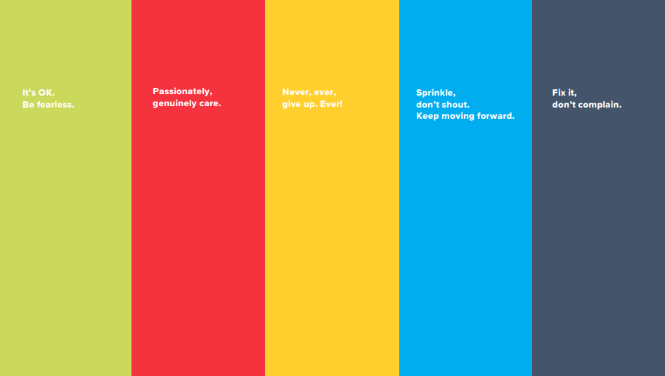

I'm excited for the chance to work at a company with real values.

## Taking the values to heart

1. "It's OK. Be fearless" - Moving into a new career was scary. I've let that fear go, and look forward to growing as a developer.

2. "Sprinkle, don't shout. Keep moving forward." - I'm looking forward to being able to practice kindness and patience going forward. Hopefully with Sprinklr!

3. "Fix it, don't complain." One thing I love about Sprinklr is their view on personal responsibility. We all make or break our success, and have a job to do. No use complaining.

4. "Never, ever give up. Ever!" - Self explanatory. I'm excited to give my all in my new career with a great team.

5. "Passionately, genuinely care." - In all my interviews and interactions with people in this industry, I have always lead with being a human centered developer. I firmly believe that with the right people you can do anything.
